# OpenShift / Kubernetes 實戰學習指南

[](https://www.openshift.com/)
[](https://kubernetes.io/)
[](https://developers.redhat.com/products/openshift-local/overview)

> 使用 OpenShift Local（原 CodeReady Containers）環境進行 OpenShift/Kubernetes 實作練習的完整學習資源

---

## 目錄

- [專案簡介](#專案簡介)
- [什麼是 OpenShift？](#什麼是-openshift)
- [什麼是 OpenShift Local？](#什麼是-openshift-local)
- [環境需求](#環境需求)
- [快速開始](#快速開始)
- [課程內容](#課程內容)
- [學習路線圖](#學習路線圖)
- [常見問題](#常見問題)

---

## 專案簡介

本專案提供一套完整的 OpenShift/Kubernetes 實戰練習教材，從基礎操作到進階應用，涵蓋 10 個學習等級、50+ 個練習題目。所有練習都可以在本機的 OpenShift Local 環境中完成，無需雲端資源。

### 特色

- 📚 **循序漸進**：從 Level 1 到 Level 10，難度逐步提升
- 🔧 **動手實作**：每個練習都有完整的指令和預期結果
- 🇹🇼 **繁體中文**：全中文說明，適合台灣學習者
- 💻 **本機環境**：使用 OpenShift Local，無需雲端費用
- 📋 **EX280 準備**：包含模擬考題，適合認證準備

---

## 什麼是 OpenShift？

[Red Hat OpenShift](https://www.openshift.com/) 是企業級的 Kubernetes 容器平台，提供完整的容器化應用程式開發、部署和管理解決方案。

### OpenShift vs 原生 Kubernetes

| 功能 | Kubernetes | OpenShift |
|------|------------|-----------|
| 容器執行環境 | 需自行配置 | 內建 CRI-O |
| 網路路由 | 需安裝 Ingress Controller | 內建 Route |
| 映像建置 | 需外部 CI/CD | 內建 S2I (Source-to-Image) |
| 安全性 | 基本 RBAC | RBAC + SCC (Security Context Constraints) |
| Web 控制台 | 需額外安裝 | 內建企業級控制台 |
| 監控告警 | 需安裝 Prometheus Stack | 內建完整監控堆疊 |
| 認證管理 | 基本認證 | 整合 OAuth、LDAP、AD |

### OpenShift 架構總覽

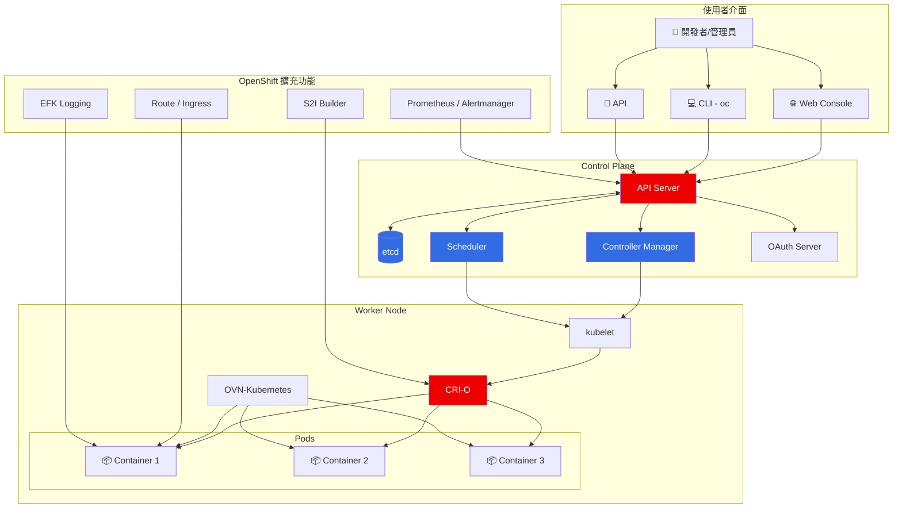

### OpenShift 網路流量架構

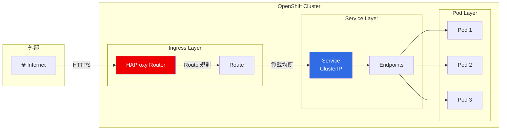

### Kubernetes 資源階層

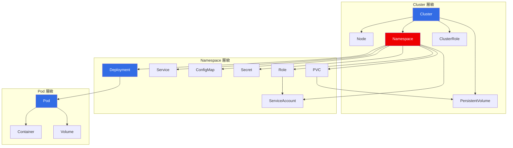

---

## 什麼是 OpenShift Local？

[Red Hat OpenShift Local](https://developers.redhat.com/products/openshift-local/overview)（原 CodeReady Containers，CLI 指令仍為 `crc`）是 Red Hat 提供的本機 OpenShift 開發環境，讓開發者可以在筆電或桌機上執行完整的 OpenShift 叢集。

### OpenShift Local 架構

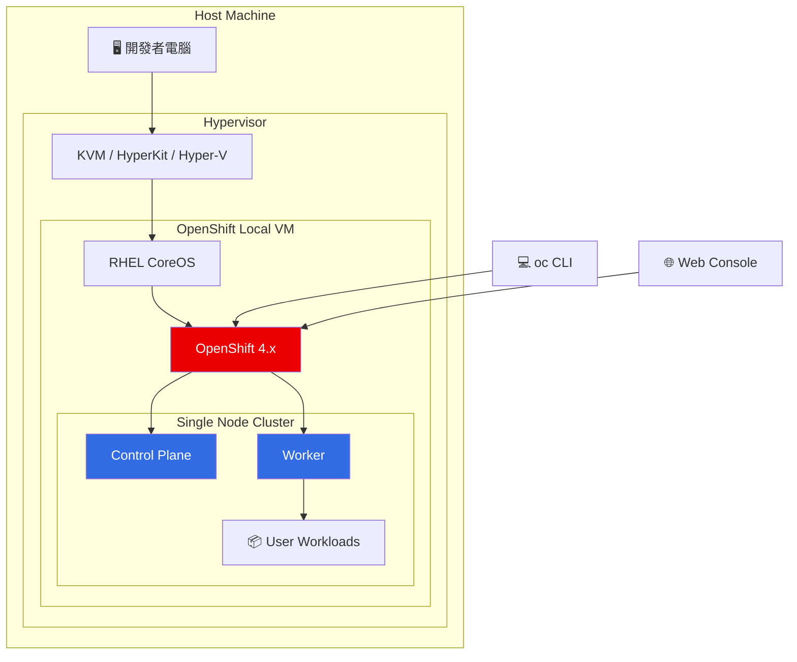

### OpenShift Local 特點

| 特點 | 說明 |
|------|------|
| 🖥️ 單節點叢集 | 在一台機器上執行完整 OpenShift |
| 💾 資源需求 | 最少 4 CPU、9GB RAM、35GB 磁碟 |
| 🚀 快速啟動 | 幾分鐘內即可使用 |
| 🆓 免費使用 | 開發者授權免費 |
| 🔄 最新版本 | 定期更新至最新 OpenShift 版本 |

### OpenShift Local vs 其他選項

| 方案 | 適用場景 | 成本 | 複雜度 |
|------|----------|------|--------|
| **OpenShift Local** | 本機開發/學習 | 免費 | 低 |
| Minikube | K8s 學習 | 免費 | 低 |
| Kind | CI/CD 測試 | 免費 | 中 |
| OpenShift Dedicated | 生產環境 | 付費 | 中 |
| 自建 OKD | 測試/生產 | 免費 | 高 |

---

## 環境需求

### 硬體需求

| 項目 | 最低需求 | 建議配置 |
|------|----------|----------|
| CPU | 4 cores | 8+ cores |
| 記憶體 | 9 GB | 16+ GB |
| 磁碟空間 | 35 GB | 100+ GB SSD |

### 軟體需求

- **作業系統**：Linux (RHEL/Fedora/Ubuntu)、macOS、Windows 10/11
- **虛擬化**：
  - Linux: KVM/libvirt
  - macOS: HyperKit
  - Windows: Hyper-V

### 安裝 OpenShift Local

```bash
# 1. 下載 OpenShift Local
# 從 https://console.redhat.com/openshift/create/local 下載

# 2. 解壓縮並安裝
tar xvf crc-linux-amd64.tar.xz
sudo mv crc-linux-*-amd64/crc /usr/local/bin/

# 3. 設定 OpenShift Local
crc setup

# 4. 啟動叢集
crc start

# 5. 設定環境變數
eval $(crc oc-env)

# 6. 登入
oc login -u developer https://api.crc.testing:6443
```

---

## 快速開始

### 1. 啟動 OpenShift Local 環境

```bash
# 啟動 OpenShift Local
crc start

# 設定 oc 命令
eval $(crc oc-env)

# 取得登入資訊
crc console --credentials
```

### 2. 登入叢集

> **⚠️ 重要提醒：** `kubeadmin` 的密碼在每次 OpenShift Local 安裝時都會自動產生，每個環境的密碼都不同。請使用 `crc console --credentials` 指令取得您環境的實際密碼。

```bash
# 以開發者身份登入
oc login -u developer -p developer https://api.crc.testing:6443

# 或以管理員身份登入（請替換 <password> 為您的實際密碼）
oc login -u kubeadmin -p <password> https://api.crc.testing:6443
```

### 3. 建立第一個應用

```bash
# 建立專案
oc new-project my-first-app

# 部署應用
oc new-app nginx:latest --name=my-nginx

# 暴露服務
oc expose svc/my-nginx

# 取得 URL
oc get route my-nginx
```

### 應用部署流程

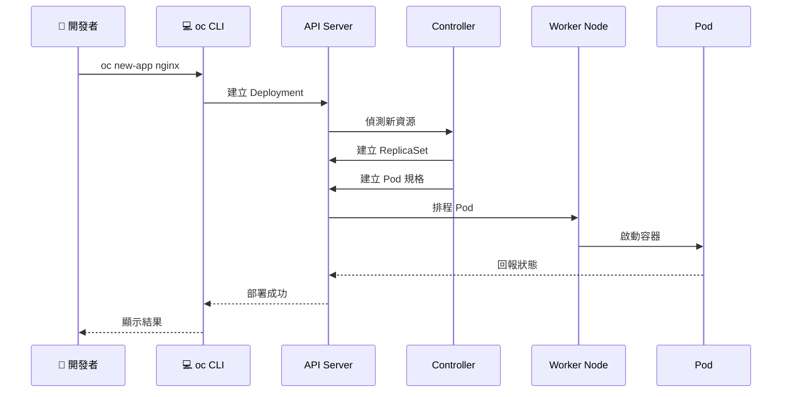

---

## 課程內容

### 課程結構總覽

```mermaid
graph LR
    subgraph "初階 Beginner"
        L1[Level 1<br/>基礎操作]
        L2[Level 2<br/>應用部署]
    end

    subgraph "中階 Intermediate"
        L3[Level 3<br/>配置管理]
        L4[Level 4<br/>網路服務]
        L5[Level 5<br/>儲存管理]
    end

    subgraph "進階 Advanced"
        L6[Level 6<br/>安全性]
        L7[Level 7<br/>監控日誌]
    end

    subgraph "專家 Expert"
        L8[Level 8<br/>CI/CD]
        L9[Level 9<br/>Operator]
        L10[Level 10<br/>綜合情境]
    end

    L1 --> L2
    L2 --> L3
    L3 --> L4
    L4 --> L5
    L5 --> L6
    L6 --> L7
    L7 --> L8
    L8 --> L9
    L9 --> L10

    style L1 fill:#4CAF50,color:#fff
    style L2 fill:#4CAF50,color:#fff
    style L3 fill:#2196F3,color:#fff
    style L4 fill:#2196F3,color:#fff
    style L5 fill:#2196F3,color:#fff
    style L6 fill:#FF9800,color:#fff
    style L7 fill:#FF9800,color:#fff
    style L8 fill:#EE0000,color:#fff
    style L9 fill:#EE0000,color:#fff
    style L10 fill:#EE0000,color:#fff
```

---

### Level 1：基礎操作（Beginner）

**適合對象**：Kubernetes/OpenShift 新手

| 練習 | 主題 | 學習目標 |
|------|------|----------|
| 1.1 | 專案與命名空間管理 | 建立、切換、標籤專案 |
| 1.2 | Pod 基本操作 | 建立、檢視、刪除 Pod |
| 1.3 | YAML 資源建立 | 使用 YAML 定義資源 |
| 1.4 | 標籤與選擇器 | 標籤管理和篩選 |
| 1.5 | 資源查詢與輸出 | YAML/JSON/JSONPath 輸出 |

📖 **指南**：[level1-beginner-guide.md](level1-beginner-guide.md)

---

### Level 2：應用部署（Intermediate）

**適合對象**：了解基礎操作者

| 練習 | 主題 | 學習目標 |
|------|------|----------|
| 2.1 | Deployment 管理 | 建立、更新、回滾、擴展 |
| 2.2 | ReplicaSet 關係 | 理解 Deployment 與 ReplicaSet |
| 2.3 | DaemonSet | 節點級服務部署 |
| 2.4 | StatefulSet | 有狀態應用部署 |
| 2.5 | Job 與 CronJob | 批次任務與定時任務 |
| 2.6 | S2I 部署 | Source-to-Image 建置 |

📖 **指南**：[level2-intermediate-guide.md](level2-intermediate-guide.md)

#### Deployment 更新流程

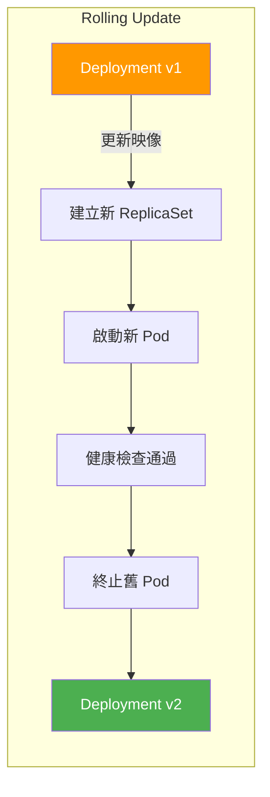

---

### Level 3：配置管理（Intermediate）

**適合對象**：需要管理應用配置者

| 練習 | 主題 | 學習目標 |
|------|------|----------|
| 3.1 | ConfigMap 操作 | 建立、掛載配置 |
| 3.2 | Secret 管理 | 敏感資料管理 |
| 3.3 | 環境變數進階 | Downward API、資源欄位 |
| 3.4 | ConfigMap 熱更新 | 配置自動更新機制 |

📖 **指南**：[level3-configmap-secret-guide.md](level3-configmap-secret-guide.md)

#### 配置注入方式

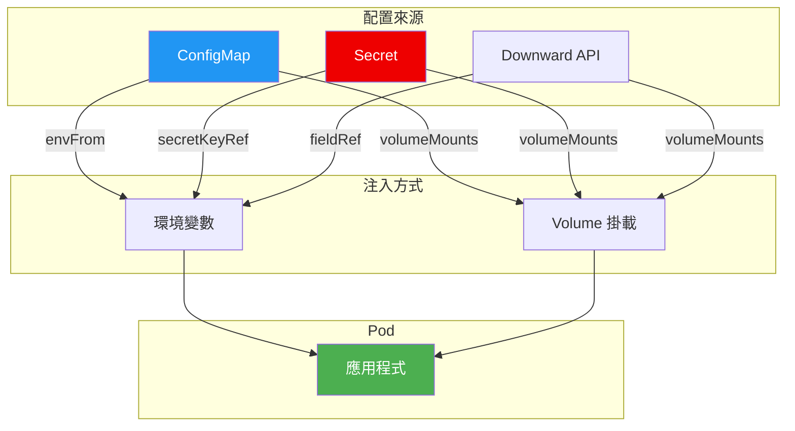

---

### Level 4：網路與服務（Intermediate）

**適合對象**：需要配置服務網路者

| 練習 | 主題 | 學習目標 |
|------|------|----------|
| 4.1 | Service 類型 | ClusterIP/NodePort/Headless |
| 4.2 | Route 配置 | HTTP/HTTPS/TLS 終止 |
| 4.3 | Ingress Controller | Ingress 資源配置 |
| 4.4 | NetworkPolicy | 網路流量控制 |
| 4.5 | 服務發現與 DNS | Kubernetes DNS 機制 |

📖 **指南**：[level4-network-services-guide.md](level4-network-services-guide.md)

#### Service 類型比較

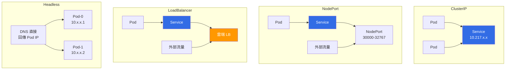

---

### Level 5：儲存管理（Intermediate）

**適合對象**：需要持久化資料者

| 練習 | 主題 | 學習目標 |
|------|------|----------|
| 5.1 | PV 與 PVC | 持久化儲存配置 |
| 5.2 | Volume 類型 | emptyDir/configMap/secret/projected |
| 5.3 | StatefulSet 儲存 | volumeClaimTemplates |
| 5.4 | 儲存快照 | VolumeSnapshot 操作 |

📖 **指南**：[level5-storage-guide.md](level5-storage-guide.md)

#### 儲存架構

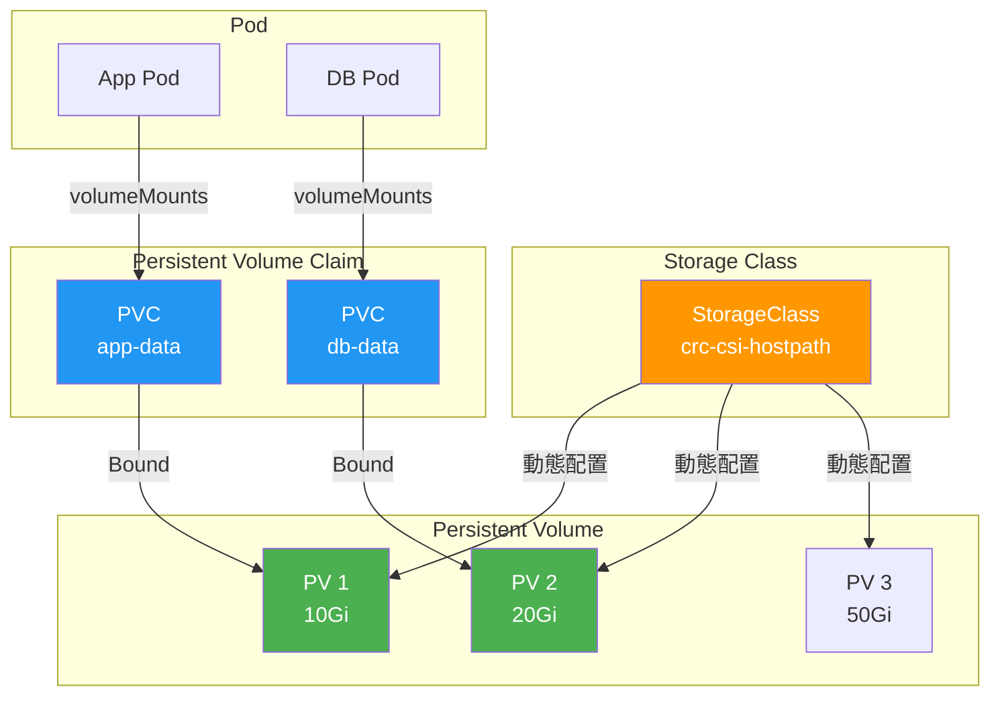

---

### Level 6：安全性（Advanced）

**適合對象**：需要配置叢集安全者

| 練習 | 主題 | 學習目標 |
|------|------|----------|
| 6.1 | RBAC 配置 | Role/RoleBinding/ServiceAccount |
| 6.2 | SCC | Security Context Constraints |
| 6.3 | Pod Security | 安全上下文配置 |
| 6.4 | Secret 加密 | 敏感資料保護 |
| 6.5 | 網路安全 | 零信任網路模型 |

📖 **指南**：[level6-security-guide.md](level6-security-guide.md)

#### RBAC 模型

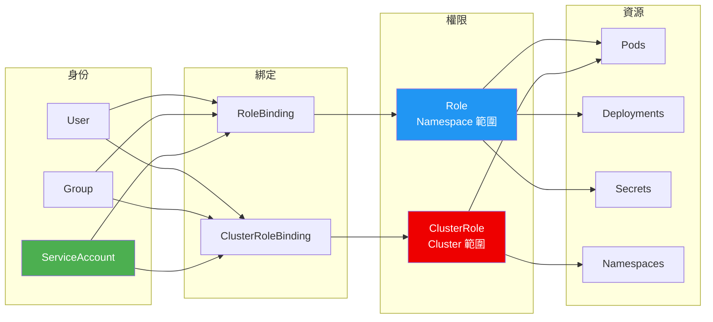

#### 零信任網路模型

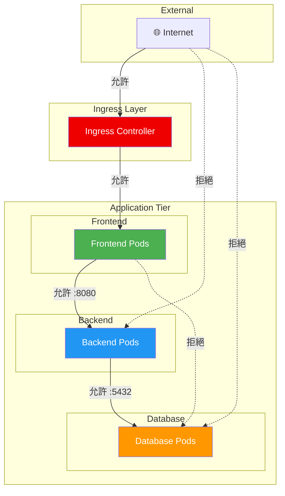

---

### Level 7-10：進階主題（Advanced/Expert）

**適合對象**：進階使用者、SRE、平台工程師

| Level | 主題 | 內容 |
|-------|------|------|
| 7 | 監控與日誌 | Prometheus、告警規則、Probes |
| 8 | CI/CD Pipeline | Tekton Task/Pipeline/Triggers |
| 9 | Operator 開發 | Operator SDK、Reconcile 邏輯 |
| 10 | 綜合情境 | 微服務架構、藍綠部署、災難恢復 |

📖 **指南**：[level7-10-advanced-guide.md](level7-10-advanced-guide.md)

#### CI/CD Pipeline 流程

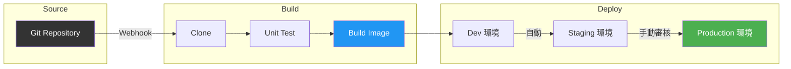

#### 微服務架構範例

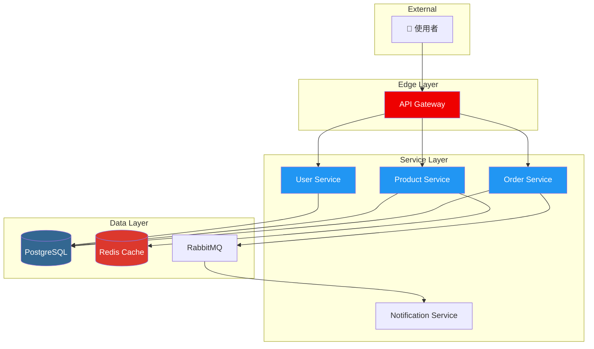

---

## 學習路線圖

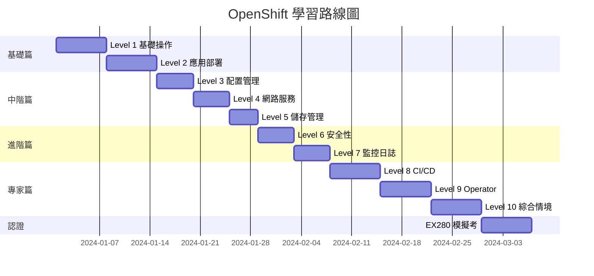

### 建議學習時間

| 等級 | 難度 | 建議時間 | 前置知識 |
|------|------|----------|----------|
| Level 1-2 | ⭐ | 8-10 小時 | Linux 基礎、容器概念 |
| Level 3-5 | ⭐⭐ | 12-15 小時 | Level 1-2 |
| Level 6-7 | ⭐⭐⭐ | 10-12 小時 | Level 3-5 |
| Level 8-10 | ⭐⭐⭐⭐ | 15-20 小時 | Level 6-7、程式開發經驗 |

---

## 常見問題

### Q: OpenShift Local 啟動失敗怎麼辦？

```bash
# 檢查虛擬化支援
egrep -c '(vmx|svm)' /proc/cpuinfo

# 重新設定
crc cleanup
crc setup
crc start
```

### Q: 如何增加 OpenShift Local 資源？

```bash
# 停止 OpenShift Local
crc stop

# 調整配置
crc config set cpus 8
crc config set memory 16384

# 重新啟動
crc start
```

### Q: 忘記 kubeadmin 密碼？

```bash
crc console --credentials
```

### Q: 如何存取 Web Console？

```bash
# 取得 Console URL
crc console --url

# 或直接開啟瀏覽器
crc console
```

---

## 相關資源

- [OpenShift 官方文件](https://docs.openshift.com/)
- [Kubernetes 官方文件](https://kubernetes.io/docs/)
- [Red Hat 開發者網站](https://developers.redhat.com/)
- [OpenShift Local 下載頁面](https://console.redhat.com/openshift/create/local)

---

## 貢獻指南

歡迎提交 Issue 或 Pull Request 來改善這份教材！

---

## 授權

本專案採用 MIT 授權條款。

---

*最後更新：2026-02-04*
